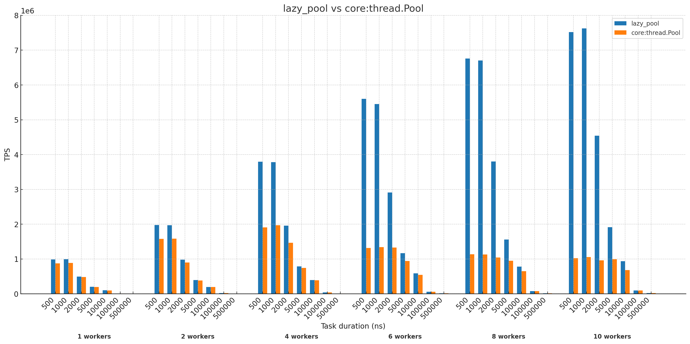
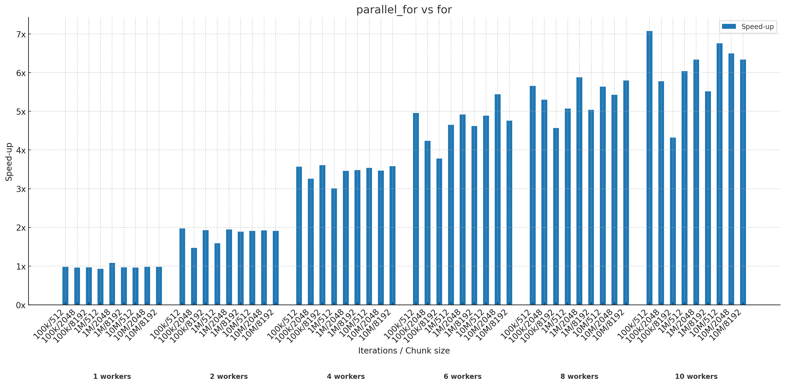

# odin-trinity

Multithreading experiments and utilities.

## lazy_pool

Work-stealing job scheduler/thread pool.

```odin
pool := new(LazyPool)
pool_init(pool, workers)
pool_start(pool)

// run one job
spawn(pool, make_job(job_fn, &args))

// run multiple jobs and wait for all to finish
group := JobGroup{pool = pool}
spawn(&group, make_job(job_fn, &args))
spawn(&group, make_job(job_fn, &args))
spawn(&group, make_job(job_fn, &args))
group_wait(&group)

job_fn :: proc(args: ^JobArgs) {
  if args.spawn_more {
    // run more jobs from within jobs
    spawn(make_job(worker, &args))
  }
}
```

Better performance than [core:thread.Pool](https://pkg.odin-lang.org/core/thread/#Pool) if:

- you want to run many small jobs, mostly taking <100 microseconds
  - (to take advantage of lock-free data structures)
- your jobs produce more jobs
  - (to take advantage of work stealing)

You can get improved multithreading performance like this (with `-o:speed`):



However if you run long-running jobs or few jobs, lazy_pool performs about the same as (or worse than) the core thread pool.

Implementation based on https://ieeexplore.ieee.org/document/9359172

### simple_pool (not committed)

Like lazy_pool but without work stealing. Like core thread pool but without mutexes.

High contention on global MPMC queue meant it performed slightly worse than lazy_pool.

### busy_pool (not committed)

Like simple_pool but uses atomic spinlock instead of notifier.

Did not perform better than lazy_pool.

## lazy_pool/tasks

Build a DAG of job dependencies.

```odin
tasks : TasksConfig(num_nodes, max_dependencies)

// add jobs with optional dependencies
a := tasks_add(&tasks, jobA)          // no dependencies
b := tasks_add(&tasks, fnB, ctxB)     // pass job function and data directly
c := tasks_add(&tasks, jobC, a)       // c must run after a
d := tasks_add(&tasks, jobD, a, b, c) // any number of dependencies

// define dependencies separately
after(&tasks, c, d) // run d after c

ok := tasks_run(&tasks, pool)
```

## lazy_pool/parallel_for

Run `for` loops chunked and multithreaded using the lazy_pool.

```odin
// simple
parallel_for(pool, n, chunk_size, proc(i: int) {})

// slice
slice := []int{1, 2, 3, ...}
parallel_for(pool, slice, 8192, proc(i: int, p: ^int) {})

// data
data: Data = {...}
parallel_for(pool, 1_000_000, 8192, proc(i: int, data: ^Data), &data)

// one call per chunk
parallel_for(pool, 1_000_000, 8192, proc(start: int, end: int, data: Data), data)
```



## lazy_pool/parallel_map

```odin
parallel_map(pool, slice, chunk_size, proc(val: int) -> int {
  return val * 2
})
```

## lazy_pool/parallel_reduce

```odin
// Reduce to same type as input
parallel_reduce(pool, slice, chunk_size, proc(acc: int, item: int) -> int {
  return acc + item
})

// Reduce to another type - extra merge fn is required
parallel_reduce(pool, slice, chunk_size, proc(acc: int, item: bool) -> int {
  return item ? acc + 3 : acc - 2
}, proc(acc: int, acc2: int) -> int {
  return acc + acc2
})
```

## parallel_quicksort

Example of using lazy_pool to implement a parallel quicksort.

## deque

Fixed-size lock-free Chase-Lev deque.

## mpsc

Fixed-size lock-free MPSC queue.

## mpmc

Fixed-size lock-free MPMC queue.

## notifier

Notifications with bounded spin loop before sleeping.

## game_of_life

Game of Life, comparing `parallel_for` with regular `for`.
Uses `parallel_for` to divide row updates across multiple workers.
